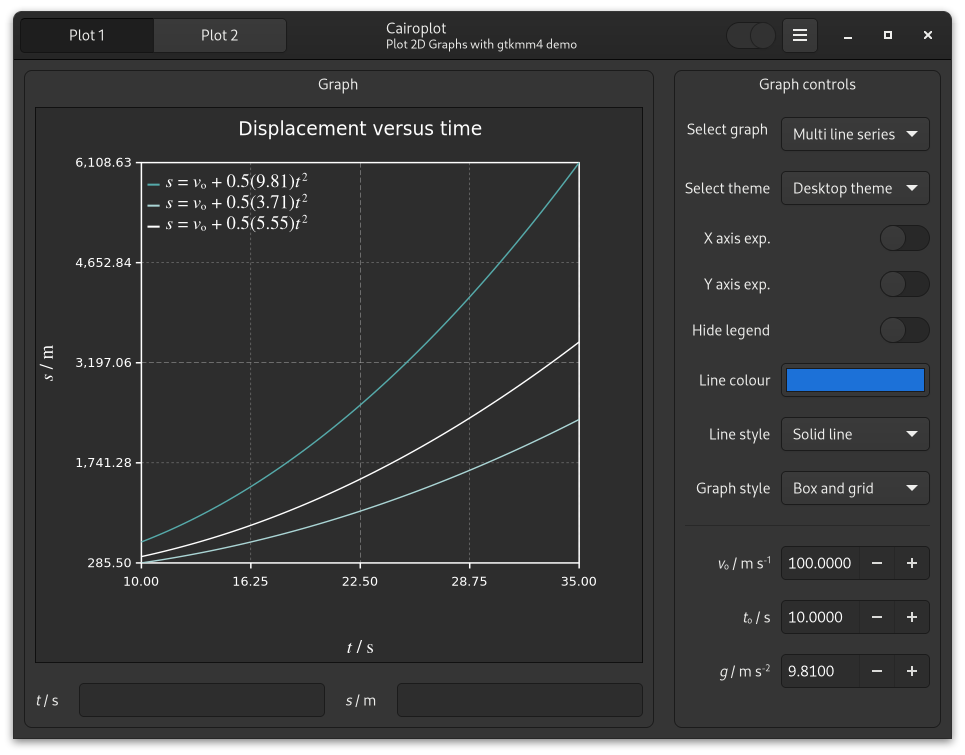
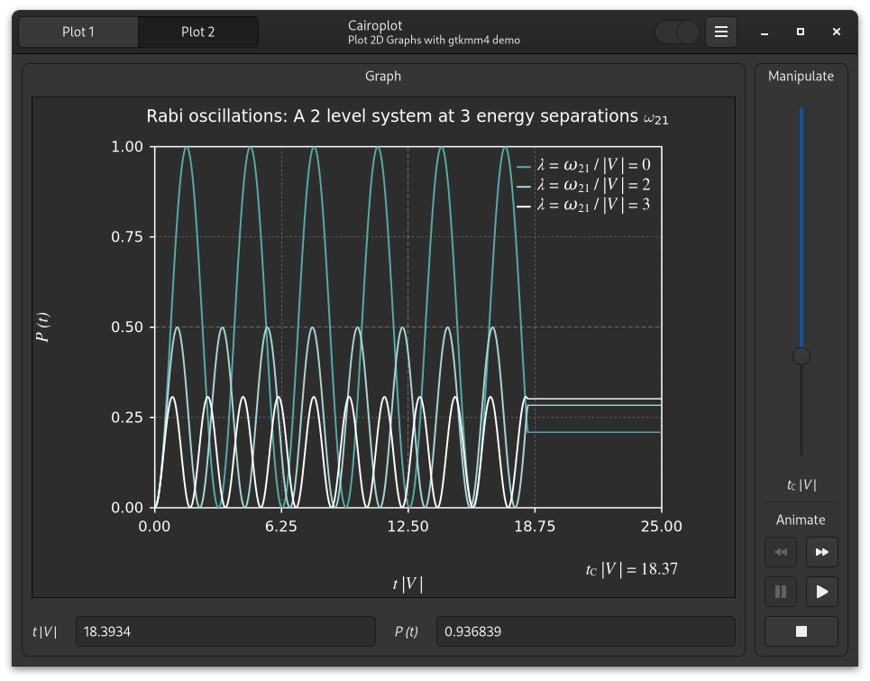

### CairoPlot - Plotting with Cairo and GTKMM4

Note: This is gtkmm4 version. If you wish to use the older gtkmm3 version git checkout  the cairoplot-gtkmm3 branch.

CairoPlot is a small library I developed to make 2D static and animated Plots in gtkmm4 applications. It is used in my TCalc project. This is a small demo of what can de done with gtkmm and cairomm,  it shows how the library can be utilised. It helps if you have the Nimbus Roman fonts installed if you desire a TeX like style for graph legends as shown in the screen shots..

#### Static plots



#### Animated plots



### Required packages

For building the demo following packages are required.

```
* git
* gettext
* appstream-util
* gtkmm 4.0.2 or greater development libraries
* meson
* Nimbus Roman font family
* ninja build system
```
Consult/search your distribution for the above packages and install them if required. in Fedora 35 it would typically involve
```
sudo dnf install gtkmm4-devel
sudo dnf appstream-util
sudo dnf gettext
```

If in doubt use dnf search to find them

```
dnf search gtkmm
dnf search appstream
dnf search nimbus
```

etc. On Ubuntu based system use apt to obtain the relevant packages.

### Building the software
```
git clone https://github.com/AlexB67/CairoPlot.git
$cd CairoPlot
$mkdir build
$meson build/
$cd build
$ninja
$sudo
```

You can run the demo from the build directory with the command
```
src/cairoplot
```

Installation is not required.

### Supported features
Multiple and single plots are supported in a single graph.
With a little work Wolfram Mathematica Manipulate/Animate style plots can also be produced. See the source code for details.

Enjoy.
